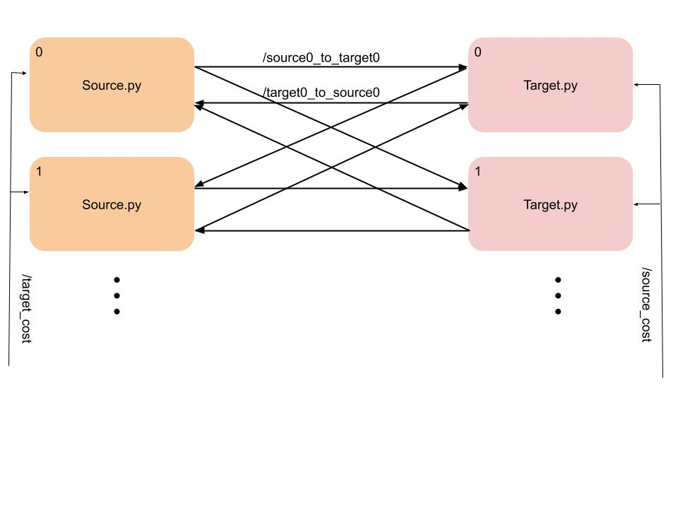

## ROSDOT ##


A ROS implementation of Distributed Optimal Transport. There are two types of nodes, target nodes and sources nodes. Sources nodes are supposed to provide target nodes with some resource. This can also be thought of more abstactly, where  the algorithm converges to some sort of cost or score between the nodes. ROSDOT will automoatically create topics between source and target nodes in both directions, they take on the name of `/source0_to_target0` and `/target0_to_source0` and so on for every connection. This repo can be used in two ways.
1. Run a simulated networked system on a single machine.
2. Run an individual target or source node.

### Requirements ###
This uses python3, it should work with and ros version that supports python3 and catkin_python_setup. You'll also need `scipy` and `numpy`.

### Running A Simulation ###

To run a simulation use the command `roslaunch rosdot sim.launch` once you've built and sourced the workspace. To add nodes, add an instance of either a target or source node in the launch file and condifure the parameters to your liking. Also, make sure you adjust the network configuration in `config/network.yaml` such that the number of target and source nodes in correct. You can also adjust the cost parameter between nodes in this file. If you do not want to hard code them you can publish on the `/target_cost` or `/source_cost` topics. The cost topics are of a message of type Float64MultiArray. 

### Running A Single Node ###
Use the `target.launch` or the `source.launch` files to launch a single node, make sure the nodes name is unique in the launch file, and should make the uid parameter. Make sure you configure the network parameters in `config/network.yaml` as you would for the simulation (see above).

### Custom Message Types ###
 Iteration.msg
 ```
 int64 node_id
 float64 data
 float64 upper_bound
 int64 k
 ```
 This is the message type used for the iterative updates. `node_id` is the uid of the target or source node. `data` is the output of the optimization problem at the iteration, `k` is the iteration and `upper_bound` is the upper bound of the node.

### TODOs ###
- Add in ability to detect convergence rather than using max_iter.
- Make is stop and wait for new info until computing again
- Publish the transport scheme on a topic
